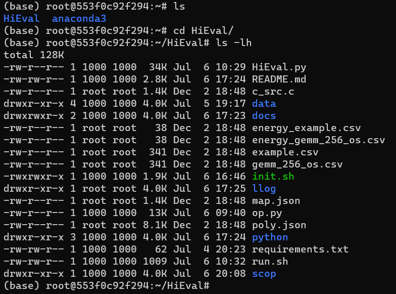

# HiEval: A Scalable Schedule Evaluation Method for Spatial Accelerator via Hierarchical Abstraction

HiEval is an analytical framework that evaluates the performance of mappings on spatial architectures. The HiEval adopts a holistic representation that can succinctly capture the various organization of the hardware and mappings. And it introduces the data placement relation to express the workload distribution and capture data transmitting between different hardware units. HiEval also provide analysis for critical performance metrics, such as data reuse, PE utilization, latency and energy.

## Requirements

HiEval leverage the [Integer Set Library](http://isl.gforge.inria.fr/) and the [Barvinok Library](http://barvinok.gforge.inria.fr/) to perform metrics analysis. To install required libraries, run our prepared script file [init.sh](init.sh).

## Project Structure
The following is the file structure and directory overview of HiEval in the docker image:
<div align="center">
  
</div>

- **data**: Contains the spatial accelerator files and mapping representation files.
- **docs**: Includes project documentation files such as technical specifications, user manuals, etc.
- **frontend**: Contains the necessary resource files for the tool that performs static analysis on C kernels.
- **python**: Contains the necessary source code for the HiEval.
- **HiEval.sh**: Main file for the project.
- **init.sh**: Auxiliary script files for installing crucial dependencies.
- **README.md**: Provides an overview of the project, installation instructions, and usage documentation.


## Installation
Please see [Installation guide](./docs/installation_guide.md)

NOTE: Currently, we are restructuring and refactoring codes. Please stay tuned for the updated version!
We offer a Docker image that contains all the necessary dependencies and source codes.
To start with HiEval, get the docker image and run a container using the image.
```
  $ sudo docker pull registry.cn-beijing.aliyuncs.com/mprl/hieval:1.0
  $ sudo docker run -tid --name=HiEval registry.cn-beijing.aliyuncs.com/mprl/hieval:1.0 /bin/bash
  $ docker attach HiEval
```
To prevent potential pull failures attributed to network issues, an alternative approach is to download the Docker image using the provided link: [HiEval](https://drive.google.com/file/d/1pvTnDQvZX58vsrzPdfEfatPjp6V6b-8x/view?usp=sharing).

### Run HiEval
After installated, activate the virtual environment. In this tutorial, the working directory is in the same directory as the HiEval.
```
(base) # conda activate HiEval_env
```

To run HiEval, please execute:
```
(HiEval_env) # python HiEval.py [options...]
```
It implicitly loads `arch.json`, `mapping.json` in the working directory for the above needed files.
If you want to specify other paths, please use the following options:
* `--scop`: path to the tool that performs static analysis on C kernels is by default './scop/scop_build'.
* `--arch`: path to the spatial accelerator definition file
	* sample: (./data/arch/ws_systolic.json)
	* Reference: [Add your spatial accelerator representation](./docs/add_arch.md)
* `--mapping`: path to the mapping definition file
	* sample: (./data/mapping/gemm_256_ws.json)
	* Reference: [Add your kernel mapping representation](./docs/add_mapping.md)
* `--csv_name`: the filename of the output result is by default 'example.csv'.

## Example
commands below output the performance evaluation results of mapping the GEMM kernel onto the weight-station dataflow spatial accelerator.
```
python HiEval.py --arch './data/arch/ws_systolic.json' --mapping './data/mapping/gemm_256_ws.json' --csv_name "gemm_256_ws.csv"
```
